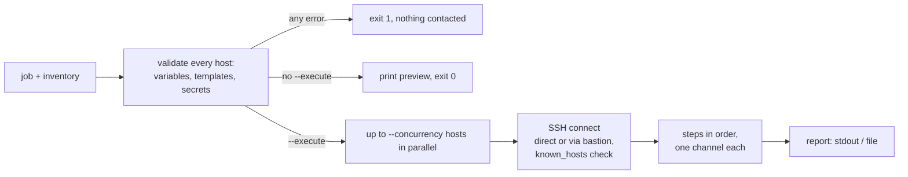

# rco — Remote Command Orchestrator

`rco` pushes configuration to many Linux hosts over SSH. You describe the
change once in a **job file** (commands, bash scripts and file uploads). `rco`
runs it on every selected host in parallel, verifies each step, and reports
exactly what happened where.

- Single static binary with no agent on the hosts. It uses pure Go SSH and never calls an `ssh` binary.
- Login with an SSH key (optionally passphrase-protected) or a username and password.
- `sudo` per step, including hosts that require a sudo password.
- Upload files, optionally rendered from a template per host, and replace them atomically.
- Host keys are verified against `known_hosts` by default.
- Every host is validated before any host is contacted, so a typo never leaves you with a half-applied change.
- Safe by default: `rco run` only previews what it would do. Nothing touches a host without `--execute`.
- Parallel with a hard limit (`--concurrency`). Ctrl+C cancels cleanly.
- Output as a table, JSON or YAML, plus an optional report file. Secrets are masked everywhere.

```text
$ rco run --inventory hosts.yaml --job jobs/configure-ntp --group web --var ntp_server=ntp1.example.com --execute
HOST     STATUS   FAILED STEP  REASON                                   DURATION
web-01   SUCCESS  -            -                                        2.41s
web-02   SUCCESS  -            -                                        2.37s
web-03   FAILED   verify       output does not contain "ntp1.example"   2.52s

3 hosts: 2 succeeded, 1 failed, 0 cancelled in 2.53s (job configure-ntp, sha256 4be1c07e93aa)
```

## Install

```bash
# the repository is private: let Go fetch it with your git credentials
GOPRIVATE=github.com/kmpoltorak/* go install github.com/kmpoltorak/remote-command-orchestrator/cmd/rco@latest
# or from a checkout:
make build        # -> bin/rco
```

Requires Go 1.27+ to build. Target hosts need `sh`, `bash` (for `script` steps),
`mktemp`, `cp`, `chmod` and `mv`, which every mainstream Linux distribution has, plus
`sudo` if steps use it.

## Quick start

1. Describe your hosts (`hosts.yaml`):

```yaml
credentials:
  deploy-key:
    type: private_key
    username: deploy
    key_file: ~/.ssh/deploy_ed25519

defaults:
  credential: deploy-key

groups:
  web:
    hosts:
      - name: web-01
        address: 10.20.1.10
      - name: web-02
        address: 10.20.1.11
```

2. Describe the change in its own folder (`jobs/uptime/job.yaml`):

```yaml
name: uptime
steps:
  - name: uptime
    command: uptime
```

3. Check it, preview it, run it:

```bash
rco validate --job jobs/uptime --inventory hosts.yaml
rco run --inventory hosts.yaml --job jobs/uptime                       # preview only
rco run --inventory hosts.yaml --job jobs/uptime --execute --verbose   # apply
```

The hosts must be in `~/.ssh/known_hosts` (see [Host keys](#host-keys)).

## Job files

### Organizing jobs

`rco` imposes no layout. `--job` accepts a directory (it loads `job.yaml` from
it) or a path to any YAML file. Paths in `script:` and `copy.src` are relative
to the job file, so it works wherever the job lives.

We recommend one folder per job: `job.yaml` plus the scripts and files it uses.
Nothing gets mixed up between jobs, and a job folder can be moved or copied as a
unit:

```text
jobs/
├── configure-ntp/
│   ├── job.yaml
│   ├── files/chrony.conf.tmpl
│   └── scripts/restart-chrony.sh
├── create-db-user/
│   └── job.yaml
└── system-info/
    └── job.yaml
```

`examples/jobs/` uses this layout. For real use, keep your jobs and inventories
in a separate repository of their own, so every change to your fleet's
configuration is versioned and reviewable. It contains no secrets, only
references to them (see [Secrets](#secrets)).

### Steps

A job is an ordered list of steps. On each host, all steps run over **one SSH
connection**, in order. A failing step stops that host unless the step sets
`continue_on_error: true`. The remaining steps are reported as `SKIPPED`.

```yaml
name: configure-ntp            # required
description: Install chrony and push its config
version: "1.2"                 # free text, shown in reports

variables:
  ntp_server:
    required: true
  ntp_pool:
    default: pool.ntp.org

defaults:                      # apply to every step unless the step overrides them
  timeout: 60s
  retries: 0
  retry_delay: 2s
  sudo: true

steps:
  - name: install-chrony
    command: DEBIAN_FRONTEND=noninteractive apt-get install -y chrony
    timeout: 5m
    retries: 2

  - name: upload-config
    copy:
      src: files/chrony.conf.tmpl        # relative to job.yaml
      dest: /etc/chrony/chrony.conf
      mode: "0644"                       # default 0644
      template: true                     # render {{ .var }} inside the file

  - name: restart
    script: scripts/restart-chrony.sh    # local file, runs with bash on the host

  - name: verify
    sudo: false
    command: chronyc -n sources
    expect:
      contains: "{{ .ntp_server }}"
      not_contains: "503 No such source"
```

### Step types

Each step has exactly one of these:

| Field | What happens on the host |
|---|---|
| `command: <text>` | Runs through the login shell, as with `ssh host '<text>'`. |
| `script: <file>` | The local file is uploaded to a private temp file (0600) and run with `bash`, then deleted. Job variables are exported at the top of the script (`$ntp_server`). |
| `copy: {src, dest, mode, template}` | The local file is uploaded, copied next to `dest`, given `mode`, then renamed over `dest`. Readers never see a half-written file. With `sudo: true` the file ends up owned by root. |

### Step options

| Option | Default | Meaning |
|---|---|---|
| `sudo` | `defaults.sudo` | Run the step as root through sudo. |
| `timeout` | `defaults.timeout`, else `--timeout` (5m) | The command is killed when this is exceeded (`COMMAND_TIMEOUT`). |
| `retries` / `retry_delay` | 0 / 2s | Re-run the step if it fails or times out. |
| `continue_on_error` | `false` | Record the failure but keep going. The host is still reported as `FAILED`. |
| `sensitive` | `false` | Mask the command and output in all output (`[SENSITIVE]`). The command is also sent as a temp file, so it never shows up in the remote process list. |
| `expect` | exit code 0 | See below. |

### Expectations

All conditions must hold:

```yaml
expect:
  exit_code: 0                  # default 0
  contains: "active (running)"  # string or list; every entry must appear
  not_contains: [ERROR, FATAL]  # none may appear
  regex: 'version \d+\.\d+'     # RE2 regex matched against stdout
```

`contains` and `not_contains` search stdout and stderr, including any part
dropped by the output limit.

### Variables

Templates use one form only: `{{ .name }}`. There are no functions, pipes or
logic, so a job file cannot execute code on your machine. Variables work in
`command`, `copy.dest`, `expect.contains`/`not_contains` and, with
`template: true`, inside uploaded files. Values may not contain newlines or
other control characters, so a variable can't inject an extra command.

Precedence (highest first):

1. Inventory variables: host, then group defaults, then inventory defaults.
2. Command line: `--var name=value` / `--var-env name=ENV_VAR`.
3. `default:` in the job file.

Variables are inserted into shell commands as-is, so treat inventory and `--var`
values as trusted input.

### Secrets

Mark a variable `sensitive: true` and pass it **only** through the environment:

```yaml
variables:
  db_password:
    required: true
    sensitive: true
steps:
  - name: create-user
    sensitive: true            # required when a step uses a sensitive variable
    command: runuser -u postgres -- psql -c "ALTER ROLE app PASSWORD '{{ .db_password }}'"
```

```bash
DB_PASSWORD=... rco run ... --var-env db_password=DB_PASSWORD --execute
```

`rco` refuses sensitive values given with `--var` or in the inventory, and refuses
a non-sensitive step that uses a sensitive variable. The values of every
secret are replaced with `[REDACTED]` wherever they would appear in output,
reports or errors. This covers passwords, key passphrases, sudo passwords and
`--var-env` values.

## Inventory

```yaml
credentials:                     # references only: rco never stores secrets
  deploy-key:
    type: private_key
    username: deploy
    key_file: ~/.ssh/deploy_ed25519
    passphrase_env: DEPLOY_KEY_PASSPHRASE   # only for encrypted keys
    sudo_password_env: DEPLOY_SUDO_PASSWORD # omit for NOPASSWD sudo
  legacy:
    type: password
    username: admin
    password_env: LEGACY_PASSWORD           # also used for sudo

bastions:
  corp-bastion:
    address: bastion.example.com
    port: 22
    credential: deploy-key

defaults:                        # inherited by every host
  port: 22
  credential: deploy-key
  variables: {ntp_pool: pool.ntp.org}

groups:
  web:
    defaults:                    # inherited by hosts in this group
      tags: [production]
      variables: {ntp_server: ntp1.example.com}
    hosts:
      - name: web-01
        address: 10.20.1.10
      - name: web-02
        address: 10.20.1.11
        port: 2222
        tags: [canary]
  internal:
    defaults:
      bastion: corp-bastion
    hosts:
      - name: db-01
        address: 10.50.1.5

hosts:                           # hosts outside any group
  - name: old-app-01
    address: 10.20.9.5
    credential: legacy
```

A host setting wins over group defaults, and group defaults win over inventory
defaults. `username` falls back to the credential's username. Unknown fields
are errors, so typos are caught.

### Selecting hosts

```bash
--group web --group db      # hosts in web OR db
--tag canary                # hosts tagged canary
--host web-01 --host db-01  # explicit hosts
--group web --tag canary    # AND across kinds: canary hosts in web
-g web -t canary            # same, with short flags
```

With no selectors, every host is selected. Unknown groups or hosts are errors.

### Environments

Recommended: split **inventories** by environment and keep **jobs** shared.

```text
inventories/
├── test/hosts.yaml
├── dev/hosts.yaml
└── prod/hosts.yaml
jobs/
└── configure-ntp/job.yaml      # one job for every environment
```

```bash
rco run --inventory inventories/test/hosts.yaml --job jobs/configure-ntp --execute
rco run --inventory inventories/prod/hosts.yaml --job jobs/configure-ntp --execute
```

- **Inventories per environment.** Environments are different hosts with
  different credentials and values. Touching prod always means typing a `prod/`
  path on purpose. `examples/inventories/` uses this layout.
- **Jobs are not split.** A job says *what* to do, and the inventory says *where*
  and *with which values*. Differences between environments (another NTP server,
  another database user) belong in the inventory's `variables`. Copies of a job
  in `jobs/test/` and `jobs/prod/` would drift apart, and prod would run
  something other than what was tested. The `hash` in the report shows that test
  and prod ran exactly the same job.
- Use tags **within** an environment to pick a subset, such as `--tag canary`.
  Keeping environments as groups or tags in one file also works, but a forgotten
  selector then selects every host, prod included.

## Authentication and sudo

- **Key**: `type: private_key` with `key_file`. Encrypted keys need `passphrase_env`.
- **Password**: `type: password` with `password_env`. Keyboard-interactive is answered too.
- Plaintext passwords are not accepted in any file.

For `sudo: true` steps, `rco` first checks once per host whether sudo works
without a password (`sudo -n true`):

- **NOPASSWD**: steps run with `sudo -n`, and no password is ever sent.
- **Password required**: steps run with `sudo -k -S`, and the password is written to
  the command's stdin. The password comes from `sudo_password_env`, or from the
  login password for `type: password`. `-k` makes sudo always read it, so it can
  never fall through to the command.

Script and file content never travels on the same stdin as the sudo password.
It is uploaded to a temp file first.

## Host keys

Host keys are checked against `~/.ssh/known_hosts` (`--known-hosts FILE`). An
unknown host fails with `HOST_KEY_UNKNOWN`, and a changed key fails with
`HOST_KEY_MISMATCH`. Neither is ever retried. Servers usually have several key
types (ed25519, ecdsa, rsa). Like OpenSSH, `rco` negotiates a type that
`known_hosts` already holds for the host, so one entry per host is enough.

To trust a new host, either verify its fingerprint out of band and add it:

```bash
ssh-keyscan -p 22 10.20.1.10 >> ~/.ssh/known_hosts
```

or let `rco` add it on first contact with `--accept-new-host-keys`. This works
like OpenSSH's `StrictHostKeyChecking=accept-new`: a host that has no entry yet
is added (the fingerprint is logged), while a host whose key **changed** is
still rejected with `HOST_KEY_MISMATCH`. The known_hosts file and its directory
are created if missing, so a dedicated file works out of the box:

```bash
rco run ... --known-hosts ~/rco/known_hosts --accept-new-host-keys --execute
```

`--insecure-skip-host-key-check` disables verification for lab use and logs a
warning. Never use it on networks you don't control.

## Running

```text
rco run --inventory FILE --job JOB [selectors] [options]

  JOB is a job directory (containing job.yaml) or a job YAML file.

  -i, --inventory FILE       inventory file
  -j, --job JOB              job directory or file
  -g, --group NAME           select hosts in group (repeatable)
  -t, --tag NAME             select hosts with tag (repeatable)
  -H, --host NAME            select host by name (repeatable)

      --execute              actually run the job; without it rco only prints a
                             preview per host and connects to nothing

      --var NAME=VALUE       job variable (repeatable)
      --var-env NAME=ENV_VAR job variable read from the environment (repeatable)
  -c, --concurrency N        hosts processed at the same time (default 100)
      --timeout D            default step timeout (default 5m)
      --connect-timeout D    TCP connect timeout (default 10s)
      --handshake-timeout D  SSH handshake + auth timeout (default 15s)
      --connect-retries N    extra attempts for transient connection errors (default 2)
      --retry-delay D        base retry delay, exponential with jitter (default 2s)
      --max-retry-delay D    cap for connection retry delay (default 30s)
      --max-output BYTES     stdout/stderr kept per step (default 1 MiB)
      --known-hosts FILE     known_hosts file (default ~/.ssh/known_hosts)
      --accept-new-host-keys add keys of unknown hosts to known_hosts; changed keys still fail
      --insecure-skip-host-key-check
  -o, --output FORMAT        stdout format: table, json or yaml (default table)
      --report FILE          also write the full report (.json/.yaml)
  -v, --verbose              table: show every step with its output
  -q, --quiet                log warnings and errors only
```

- Every flag also works with a single dash (`-execute`). `--execute` has no
  short form on purpose: applying changes is always typed out in full.
- **Preview is the default.** Without `--execute`, `rco run` validates everything
  and prints the steps per host (or JSON/YAML with `--output`) without connecting
  or reading any key or password.
- **stdout** carries results only and **stderr** carries logs, so `rco run ... --execute --output json | jq` works.
- **Exit codes**: `0` means every host succeeded, `2` means the run finished but some host
  failed or was cancelled, and `1` means a usage, validation or file error, in which case no host was contacted.
- **Connection retries** apply only to transient errors: timeouts, refused
  connections, broken handshakes. Authentication, host key and DNS errors fail
  immediately.
- **Output limit**: when a step prints more than `--max-output`, the first
  and last halves are kept with a `...[truncated N bytes]...` marker.
- **Ctrl+C** stops starting new hosts, kills running commands, and still
  prints and writes the report. Unfinished hosts are `CANCELLED`.

`rco validate --job JOB [--inventory FILE ...]` checks the job and, when
an inventory is given, variables and credentials for every selected host,
without connecting.

### Report

`--output json|yaml` and `--report FILE` produce the same document:

```json
{
  "job": "configure-ntp", "version": "1.2", "hash": "4be1c07e…",
  "started_at": "2026-09-25T08:00:00Z", "finished_at": "…", "duration": "2.53s",
  "summary": {"total": 3, "success": 2, "failed": 1, "cancelled": 0},
  "hosts": [{
    "host": "web-03", "address": "10.20.1.12:22", "status": "FAILED",
    "failed_step": "verify", "failure_category": "COMMAND_FAILED",
    "failure_reason": "output does not contain \"ntp1.example.com\"",
    "connect_attempts": 1, "duration": "2.52s",
    "steps": [{"name": "install-chrony", "kind": "command", "command": "…",
               "status": "SUCCESS", "attempts": 1, "exit_code": 0,
               "stdout": "…", "duration": "1.8s"}]
  }]
}
```

`hash` is the SHA-256 of the job file plus every script and uploaded file, so a
report identifies exactly what ran. Report files are created with mode 0600.

Failure categories: `CONNECTION_TIMEOUT`, `CONNECTION_REFUSED`, `DNS_FAILURE`,
`AUTH_FAILED`, `HOST_KEY_MISMATCH`, `HOST_KEY_UNKNOWN`, `SSH_HANDSHAKE_FAILED`,
`SESSION_FAILED`, `COMMAND_TIMEOUT`, `COMMAND_FAILED`, `TEMPLATE_ERROR`,
`CANCELLED`, `INTERNAL_ERROR`.

## How it works



## Limitations

- Linux-like hosts only (POSIX `sh` plus `bash` for scripts). No Windows, no network-device CLIs.
- No history database. Keep the `--report` files if you need an audit trail.
- No ssh-agent support, by design.
- Steps are not rolled back automatically. Write jobs so they can safely be run again.

## Development

```bash
make check    # gofmt, go vet, go test -race, go build (same as CI)
make lint     # golangci-lint
make vuln     # govulncheck: known vulnerabilities in reachable code
make build    # bin/rco
```

Keep personal test inventories and jobs in `local/` at the repository root.
It is git-ignored, so hosts and key paths never end up in a commit.

### Code layout

The tests start real SSH servers in-process (`internal/sshtest`). They run
genuine shell commands in temp directories with a fake `sudo`, so the whole
suite runs offline in a few seconds.

| Package | Purpose |
|---|---|
| `cmd/rco` | entry point |
| `internal/cli` | flags, output formats, preview |
| `internal/job` | job file parsing, validation, variables, remote command building |
| `internal/inventory` | inventory parsing, inheritance, host selection |
| `internal/credentials` | keys, passwords, sudo passwords, redaction |
| `internal/runner` | parallel execution, retries, expectations, report |
| `internal/sshx` | SSH dial (with bastion), host keys, exec with bounded output |
| `internal/sshtest` | in-process SSH server for tests |

### Versions and releases

`make build` stamps the version from `git describe --tags --always --dirty`,
and `rco version` prints it:

| `rco version` | Meaning |
|---|---|
| `rco v0.1.0` | built exactly from tag `v0.1.0` |
| `rco v0.1.0-3-g9c1d2e3` | 3 commits after `v0.1.0`, at commit `9c1d2e3` |
| `rco 9c1d2e3` | no tags yet, commit `9c1d2e3` |
| `…-dirty` | built with uncommitted changes, so it matches no commit exactly |

To release, tag `main` (`git tag v0.1.0 && git push origin v0.1.0`) and build
from the tag.

## License

MIT, see [LICENSE](LICENSE).
